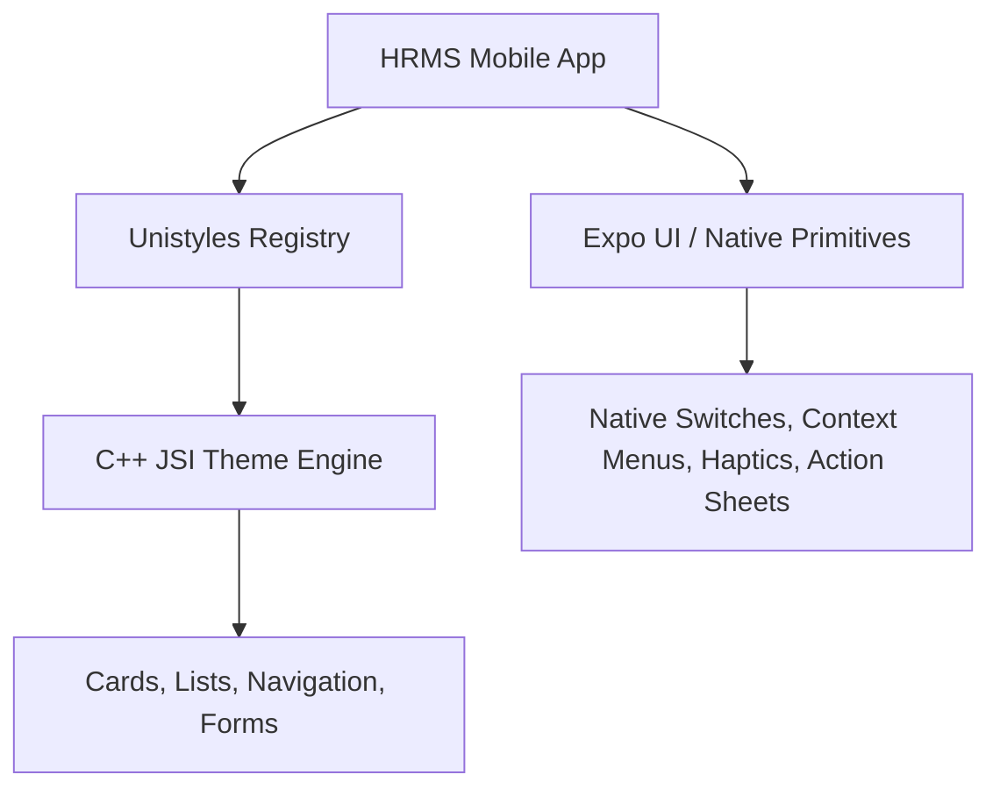

# HRMS Mobile App - UI Architecture Guide

## Overview

This guide documents the UI architecture, styling strategy, and design system implementation for `hrms-app`. 

To achieve **maximum rendering performance (60–120 FPS)**, **zero JS-thread layout bottlenecks**, and a **true platform-native look & feel**, the app uses **React Native Unistyles** for custom component styling paired with **Expo UI / Native OS Primitives**.

---

## 🏛 Core Stack & Architecture



### Why We Moved Away From NativeWind

1. **JS Bridge Overhead**: NativeWind v4 parses CSS strings and maps class names at runtime on the JS thread, which can cause micro-stutters during screen transitions or fast scrolling lists on mid/low-end Android devices.
2. **Re-render Cost**: Theme switching in NativeWind triggers React re-renders across component subtrees.
3. **C++ JSI Advantage in Unistyles**: Unistyles uses direct C++ JSI bindings to modify views at the native engine level without passing serialized style props over the JS bridge or causing component re-renders.

---

## 🎨 Design System & Theme Engine

### 1. Theme Tokens (`src/styles/theme.ts`)

All design tokens (colors, spacing, radii, shadows) are defined centrally in `src/styles/theme.ts` with strict TypeScript `as const` definitions:

```typescript
export const lightTheme = {
  colors: {
    background: '#F8FAFC',
    surface: '#FFFFFF',
    surfaceSecondary: '#F1F5F9',
    textPrimary: '#0F172A',
    textSecondary: '#475569',
    textMuted: '#94A3B8',
    border: '#E2E8F0',
    primary: '#2563EB',
    primaryHover: '#1D4ED8',
    success: '#10B981',
    warning: '#F59E0B',
    danger: '#EF4444',
    card: '#FFFFFF',
  },
  spacing: {
    xs: 4,
    sm: 8,
    md: 16,
    lg: 24,
    xl: 32,
  },
  borderRadius: {
    sm: 6,
    md: 12,
    lg: 16,
    full: 9999,
  },
  shadows: { /* platform shadow specs */ }
} as const;
```

### 2. Unistyles Configuration (`src/styles/unistyles.ts`)

`StyleSheet.configure` registers theme objects and responsive breakpoints globally:

```typescript
import { StyleSheet } from 'react-native-unistyles';
import { lightTheme, darkTheme } from './theme';

export const breakpoints = {
  xs: 0,
  sm: 380,
  md: 768,
  lg: 1024,
  xl: 1280,
} as const;

StyleSheet.configure({
  breakpoints,
  themes: { light: lightTheme, dark: darkTheme },
  settings: { initialTheme: 'dark' }
});
```

---

## 💻 Developer Patterns & Usage Guidelines

### 1. Writing Styles with `StyleSheet.create`

Use `StyleSheet.create` from `react-native-unistyles` to style components. Theme tokens and breakpoints are automatically typed and injected:

```tsx
import React from 'react';
import { View, Text } from 'react-native';
import { StyleSheet, useUnistyles } from 'react-native-unistyles';

export const StatusCard: React.FC<{ title: string }> = ({ title }) => {
  const { theme } = useUnistyles();

  return (
    <View style={styles.card}>
      <Text style={styles.title}>{title}</Text>
    </View>
  );
};

const styles = StyleSheet.create((theme) => ({
  card: {
    backgroundColor: theme.colors.surface,
    padding: theme.spacing.md,
    borderRadius: theme.borderRadius.md,
    borderColor: theme.colors.border,
    borderWidth: 1,
  },
  title: {
    color: theme.colors.textPrimary,
    fontSize: 16,
    fontWeight: '600',
  },
}));
```

### 2. Dynamic Theme Switching

Use `UnistylesRuntime` for instant zero-re-render theme switches:

```typescript
import { UnistylesRuntime } from 'react-native-unistyles';

// Switch theme instantly at C++ layer
UnistylesRuntime.setTheme('dark');
```

---

## 🚀 Native UI Guidelines (Expo UI / Native Primitives)

To maintain an authentic platform feel:

1. **Use System Haptics**: Invoke `expo-haptics` (`Haptics.impactAsync(Haptics.ImpactFeedbackStyle.Light)`) on key user interactions (button taps, swipe actions, toggle switches).
2. **Platform Icons**: Use system-aware SVG icons (`lucide-react-native`) with colors bound to `theme.colors.textPrimary` or `theme.colors.primary`.
3. **Safe Areas**: Wrap screens in `SafeAreaView` from `react-native-safe-area-context` and respect status bar styling per active theme.
4. **Native Action Sheets & Menus**: Prefer platform-native context menus and bottom sheets over custom web-like popups.

---

## ⚡ Performance Best Practices

* **Avoid In-line Object Styles**: Do not pass inline style objects (`style={{ padding: 16 }}`) inside render loops. Always define them in `createStyleSheet`.
* **Use Variant Maps**: Use Unistyles variant definitions instead of conditional style arrays (`[styles.card, isActive && styles.active]`).
* **Optimize FlatLists**: Always pass `getItemLayout`, `keyExtractor`, and memoized item components (`React.memo`) for attendance and employee lists.
